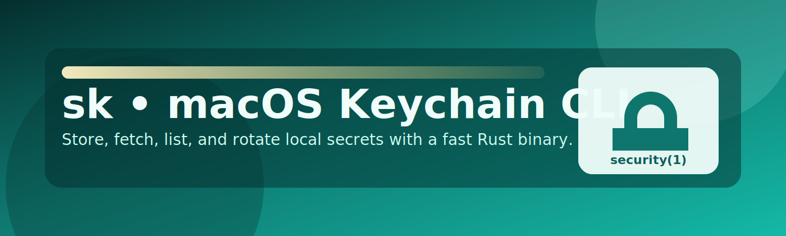

# sk 🔐⚡



[](https://github.com/dmoliveira/sk/actions/workflows/ci.yml)
[](https://github.com/dmoliveira/sk/actions/workflows/release.yml)
[](https://github.com/dmoliveira/sk/releases/latest)
[](https://dmoliveira.github.io/sk/)
[](https://github.com/dmoliveira/sk/wiki)
[](LICENSE)
[](https://github.com/dmoliveira/sk/commits/main)
[](https://github.com/dmoliveira/sk/issues)
[](https://github.com/dmoliveira/sk/stargazers)
[](https://buy.stripe.com/8x200i8bSgVe3Vl3g8bfO00)

## Support sk 💛

If `sk` helps your workflow, support ongoing maintenance and future improvements:

- Stripe: [Support sk](https://buy.stripe.com/8x200i8bSgVe3Vl3g8bfO00)
- GitHub Sponsors: https://github.com/sponsors/dmoliveira

A fast Rust CLI for macOS Keychain: add, fetch, list, rotate, and remove local secrets by key.

Made by Diego Marinho de Oliveira.

Hero asset note: `docs/assets/hero-banner.svg` is an editable SVG derived from a GPT-Image-1.5 style prompt for this project identity.

## Quick Start 🚀

## Trust & Security at a Glance 🔎

- Local-only secret storage via macOS Keychain (`security`)
- No cloud sync, external vault backend, or remote secret transport
- Safe automation path: pass values using `--stdin`
- Namespacing and user targeting supported via `SK_SERVICE_PREFIX` and `SK_USER`

```bash
cargo build --release
./target/release/sk --version
```

Store and read a value:

```bash
./target/release/sk add -k OPENAI_API_KEY --stdin --force <<<"sk-xxxx"
./target/release/sk get -k OPENAI_API_KEY
```

## Install 📦

### Homebrew (tap)

```bash
brew tap dmoliveira/tap
brew install sk
```

If you are building your own tap, see `TAP.md`.

### Cargo (recommended for contributors)

```bash
cargo install --path .
```

### Local install command

```bash
cargo build --release
./target/release/sk install
```

Override install location:

```bash
SK_INSTALL_DIR="$HOME/bin" ./target/release/sk install
```

If `~/.local/bin` is not in your `PATH`:

```bash
export PATH="$HOME/.local/bin:$PATH"
```

## Usage 🧰

Add secret:

```bash
sk add -k OPENAI_API_KEY -v "sk-xxxx"
```

Add from stdin (safer for shell history):

```bash
printf '%s' "sk-xxxx" | sk add -k OPENAI_API_KEY --stdin
```

Overwrite existing key:

```bash
sk add -k OPENAI_API_KEY -v "sk-xxxx" --force
```

Read secret:

```bash
export OPENAI_API_KEY="$(sk get -k OPENAI_API_KEY)"
```

List keys (default):

```bash
sk list
```

List masked values:

```bash
sk list --show
```

Remove a key:

```bash
sk remove -k OPENAI_API_KEY -y
```

Run keychain self-check:

```bash
sk selfcheck
```

## Docs for Humans and AI 🤝🤖

- CLI contract: `docs/specs/cli-contract.md`
- Release checklist: `RELEASE.md`
- Release dashboard: `docs/release.md`
- Changelog: `CHANGELOG.md`
- Tap snippet helper: `scripts/release-tap-snippet.sh`
- Homebrew tap flow: `TAP.md`
- GitHub Pages map: `docs/plan/github-pages-site-map.md`
- Support page: `docs/support-the-project.md`
- Wiki support snippet: `docs/wiki-support-snippet.md`
- Changelog and releases: `https://github.com/dmoliveira/sk/releases`

## Security Notes 🛡️

- macOS only (`security` command is required)
- Prefer `--stdin` for sensitive values in automation
- Use custom namespace via `SK_SERVICE_PREFIX` when sharing systems
- Set `SK_USER` to target a specific account explicitly

## Quality Checks ✅

```bash
cargo fmt --check
cargo test
./scripts/smoke.sh
make release-snippet TAG=v0.2.1
```

## Support This Project 💛

- Donation options: `docs/support-the-project.md`
- Direct support link: https://buy.stripe.com/8x200i8bSgVe3Vl3g8bfO00
- Wiki snippet for public support messaging: `docs/wiki-support-snippet.md`

## License 📄

MIT
